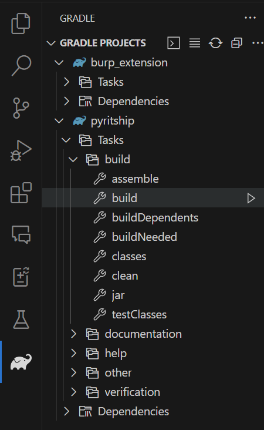

# BURP Suite Extension

## Visual Studio Code Setup
The following extensions were used by our team to develop and build the solution in Visual Studio Code:

- **Debugger for Java** (by Microsoft)
- **Extension Pack for Java** (by Microsoft)
- **Gradle for Java** (by Microsoft)

We downloaded Java runtime and SDK 21 from [https://jdk.java.net/java-se-ri/21](https://jdk.java.net/java-se-ri/21). To setup the runtime with VS Code, open **File** > **Preferences** > **Settings**
1. Search for **java home**
2. Click **edit in settings.json**
    - Point to where you extracted the JDK, for example:
    ```json
        "java.jdt.ls.java.home": "C:\\Program Files\\Java\\jdk-21"
    ```
    - Save and Close
3. Search for **java runtimes**
4. Click **edit in settings.json**
    - This opens the same file, but adds a node for you to add the runtime location:
    ```json
    "java.configuration.runtimes": [
        {
            "name": "JavaSE-21",
            "path": "C:\\Program Files\\Java\\jdk-21",
            "default": true,
        },
    ]
    ```
    - Save and close
5. Restart VS Code

## Building the Java extension

Open the burp_extension folder in VS Code as the root folder. After the extensions have fully loaded your project, you should see the Gradle elephant icon. After clicking on it you can find **pyritship** > **build** > **build** option. Right-click and select **Run task** to build the extension.



## Adding the Java extension to Burp Suite

After building the extension with Gradle, the **burp_extension** folder should now have the pyritship JAR file in the **pyritship/libs** folder.

In BURP Suite, go to the **Extensions** tab and click the **Add** button. Select **Java** as the extension type, and select the JAR file you built. Click **Next**. You should see a message that the extension was loaded successfully, and you can close the dialog. You now have a **PyRIT Ship** tab available in BURP Suite.

## Settings
The following settings can be found on the PyRIT Ship tab in BURP Suite after loading the extension.

| Setting | Config Setting | Comment |
| --- | --- | --- |
| PyRIT Ship | PyRIT Ship URL | This is the URL to PyRIT Ship. Defaults to http://127.0.0.1:5001 which is the default setting of PyRIT Ship |
| Intruder | Goal Description | The prompt sent to the LLM to generate prompts. Default value is the prompt used to attack Gandalf. |
| Intruder | Response Payload Parse Field | The JSON path to where the response text is found that needs to be scored. This defaults to /answer which is the Gandalf response path. |
| Intruder | Max tries | Maximum number of prompts that will be generated before giving up, regardless of a successful scoring. |
| Intruder | Scorer Name | The name of the scorer to use. Currently only SelfAskTrueFalseScorer is available. |
| Intruder | Scoring (true) should end intruder when | The description for the scorer on when to decide to return true. |
| Intruder | Scoring (false) should continue intruder when | The description for the scorer on when to decide to return false. |
| HTTP Intercept | Enabled | Experimental. This enables the converter intercept on all HTTP requests. |
| HTTP Intercept | Converter Name | Name of the converter to use. Currently hardcoded to ROT13Converter. |
| WebSocket | Enabled | Experimental. This enables the converter intercept on all WebSocket requests. |
| WebSocket Intercept | Converter Name | Name of the converter to use. Currently hardcoded to ROT13Converter. |

## Troubleshooting
PyRIT Ship does not have many explicit troubleshooting features at this point. However, some specific logging as well as errors/exceptions can be found on the Extensions tab in BURP Suite, under the Output/Errors tab after selecting PyRIT Ship in the list of extensions.
